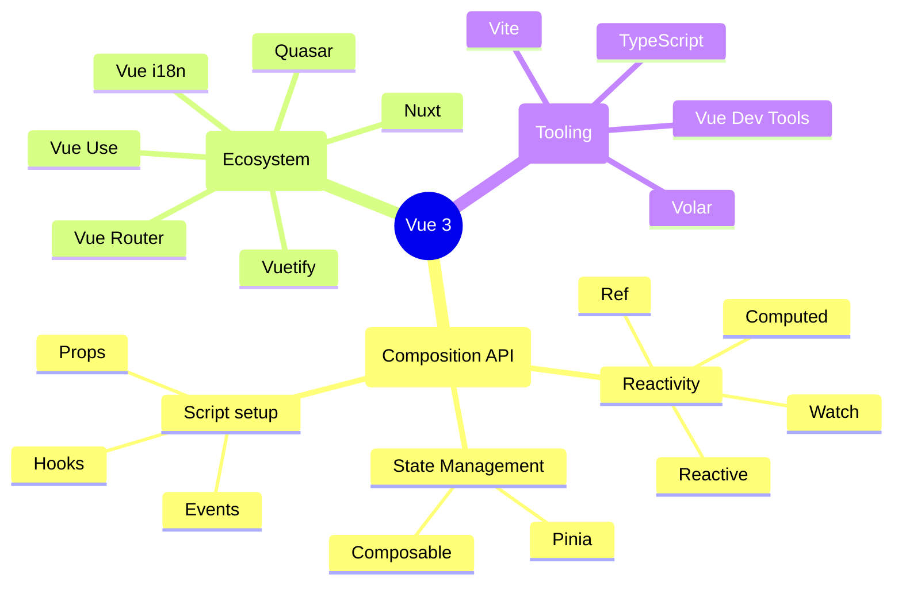

## Plan

Intro
Qui suis-je ?
Sommaire
N°1 : De l'Options API à la Composition API
N°2 : La réactivité
N°3 : Gestion d'état
N°4 : L'outillage
N°5 : L'écosystème
Récapitulatif sur Vue 3
Conclusion

## Contenu Réactivité

* ref
* reactive
* computed
* watch

## Contenu Outillage

* TypeScript
* Vite
* Vue Language Features (basé sur Volar.js)
* Vue Dev Tools

## Liens

- Mastodon : @techwatching@mas.to
- Tweet Evan You : https://twitter.com/youyuxi/status/1629099142214713344
- VueUse : https://vueuse.org/
- VueUse playground : https://play.vueuse.org/
- Vue : https://vuejs.org/
- Open Feedback : https://drp.li/Ed1od
- blog : https://techwatching.dev

## Mindmap Vue

